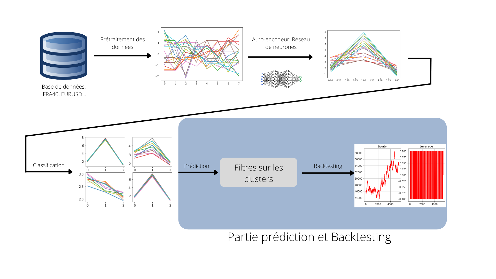

# Times Series Patterns Classification for Market Prediction
Le but de ce project est de faire la prédiction de la variation des séries
temporelles, notamment l'exemple des cours des indices boursiers, par 
des approches employant l'apprentissage non supervisé.

Le modèle de prédiction commence par faire l'apprentissage sur un jeu de données 
extrait de la base de données disponible après l'étape de préprocessing et 
d'utilisation d'autoencodeur. Le but de ces deux étapes est d'essayer d'optimiser
au maximum l'apprentissage du modèle de classifiation qui viendra par la suite.
Le classificateur est basé sur l'algorithme "Kmeans++" qu'on a essayé d'améliorer
en prenant plusieurs classificateur et en faisant des raffinements entre leurs
centroides respectives. On a réussi à montrer que cette approche arrive à converger
en faisant plus de 25 itérations de raffinement.  

Une fois le classificateur final est prêt, on procède par des filtres sur les clusters
obtenus. Ces filtres sont basés sur des approches économiques pour que le modèle soit
plus pertinent. Finalement on arrive à faire le backtesting pour voir à quel point 
le modèle est pertinent, ça pourrait aussi être utilisé comme outil de prédiction 
de la cours des actifs boursiers.

### Mode d'emploi:
Le project est divisé en plusieurs code selon la partie en question. Mais pour faire 
tourner l'algorithme de prédiction, il faut d'abord installer les bibliothèques suivantes: 
pandas, matplotlib, keras, tensorflow, numpy, sklearn et fpdf; une façon simple de le faire 
est d'utiliser la commande `pip install package` en remplaçant package à chaque fois par 
la bibliothèsue à installer. Puis il suffit d'utiliser le fichier `main.py` en choisissant
les paramètres convenables:

- `path`: ça doit être le chemin contenant la base de donnée
- `index0` : prend soit la valeur 'NON_FOREX', soit 'FOREX' 
- `index` : C'est l'indice à prédire
- `date_start` : La date du début de l'apprentissage, doit être sous le format "%Y-%M-%D %H-%M-%S"
- `date_end_train` : La date du fin de l'apprentissage, doit être sous le format "%Y-%M-%D %H-%M-%S"
- `date_end_test` : La date du fin du backtesting, doit être sous le format "%Y-%M-%D %H-%M-%S"
- `longueur` : la longueur de la séquence de données 
- `echantillon` : L'intervalle duquel on tire la séquence de points

Une fois le programme finit son execution, il crée un fichier pdf sur le même
`path` contenant le bilan du backtesting sur les périodes des temps
indiquées aupravant.

### Notebook Jupyter:
Pour faire l'étude théorique de notre modèle, nous avons utilisé des notebooks jupyter. 
Vous trouvez dans le dossiers notebook deux fichiers; un notebook `Encoder.ipynb` concernant les modèles
des autoencodeurs, ainsi qu'un deuxième `Clustering.ipynb` s'interessant plutôt à l'étude des classificateurs
et surtout leur stabilité.
